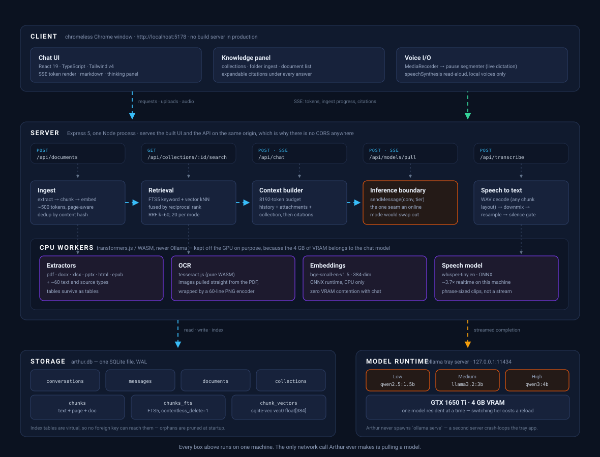

# Arthur

**A local-first AI chat application with retrieval, documents and voice — running entirely on your own machine.**

No API key, no cloud, no telemetry. Local models via [Ollama](https://ollama.com), served as a
desktop app in a chromeless window. The reference machine is a **GTX 1650 Ti with 4 GB of VRAM**,
and that constraint drives most of the design in this repository.

[](#overview)
[](#)
[](#tech-stack)
[](#testing)
[](#getting-started)

<br clear="right">

---

## Overview

Arthur is a full-stack application that turns a modest gaming laptop into a private AI workspace.
It streams answers from local language models, reads your documents — including **scanned PDFs**,
Office files and EPUBs — and answers from them with **citations you can open and check**.

The interesting engineering isn't the chat loop; it's everything the 4 GB ceiling forces. Only one
model fits in VRAM at a time, context is capped at 8192 tokens, and every supporting model
(embeddings, OCR, speech) is deliberately pushed onto the CPU so it never competes with the model
that's generating. Retrieval, not truncation, is what makes a 200-page PDF answerable inside that
budget.

Everything ships as **one Node process on one port**, so the production app has no CORS layer, no
second service and no build server — you double-click an icon and a window opens.

### Highlights

| | |
|---|---|
| 🔒 **Fully offline** | The only network call ever made is downloading a model |
| 🧠 **Three effort tiers** | Three different local models, switchable per conversation |
| 📄 **Nine document formats** | PDF, scanned PDF (OCR), DOCX, XLSX, PPTX, HTML, EPUB, ~60 text types |
| 🔍 **Hybrid retrieval** | FTS5 keyword search + vector similarity, fused by reciprocal rank |
| 📎 **Verifiable citations** | Every retrieved answer shows the passages it was built from |
| 📚 **Collections** | Index a folder once, reuse it across conversations |
| 🎙️ **Live dictation** | Words appear as you speak, via `whisper-tiny.en` on CPU |
| 🔊 **Read aloud** | Answers spoken back using local system voices only |
| 💾 **Durable history** | SQLite with WAL; conversations survive restarts |
| 🖥️ **Double-click install** | One script builds the app and puts it on your Desktop |

---

## Architecture

<p align="center">
  
</p>

### Request lifecycle

A chat turn with an attached document travels the whole system:

1. **Upload** — the browser `POST`s the file to `/api/documents`. The server picks an extractor by
   extension, pulls out text page by page, and OCRs any page that has no text layer.
2. **Index** — the text is chunked at ~500 tokens on page boundaries, embedded on the CPU, and
   written to `chunks`, `chunks_fts` and `chunk_vectors` in a single transaction. Progress streams
   back as SSE so the chip can count.
3. **Ask** — the question goes to `/api/chat`. If the attachment fits the token budget it's injected
   whole; if not, retrieval runs — keyword and vector search in parallel, fused by RRF — and only the
   passages that answer *this question* are sent.
4. **Generate** — the context builder assembles history, attachments and collection material inside
   8192 tokens, then hands it to `sendMessage(conversation, tier)`, the single seam through which all
   inference passes.
5. **Stream** — tokens come back over SSE and render live. The passages used are stored against the
   answer, so reopening the conversation months later shows the same citations.

### Design decisions worth knowing

<details>
<summary><b>Why SQLite + sqlite-vec instead of a vector database</b></summary>

<br>

A separate vector store (ChromaDB, Qdrant) means a second process, a second runtime and a second
thing to install. `sqlite-vec` is a loadable extension that lives **in the same `arthur.db` file** as
the conversations, so a chunk and its embedding are written in one transaction and retrieval is a
`SELECT` in the same process.

That choice paid for itself when a real bug appeared: `chunk_vectors` and `chunks_fts` are virtual
tables, which **cannot participate in a foreign key**. Deleting a conversation cascaded away its
chunks while both indexes kept every row; SQLite then reused those freed rowids and failed on a
UNIQUE constraint — silently disabling retrieval for an entire phase. Because everything is one
database, the fix was a startup prune and rowid-clearing inserts rather than a cross-service
reconciliation job.
</details>

<details>
<summary><b>Why every supporting model runs on the CPU</b></summary>

<br>

With 4 GB of VRAM, anything that shares the GPU with the chat model evicts it. Embeddings
(`bge-small-en-v1.5`), speech (`whisper-tiny.en`) and OCR (`tesseract.js`) therefore all run on the
CPU through ONNX/WASM — never through Ollama. Indexing a document while a conversation is open costs
latency, not a model reload.
</details>

<details>
<summary><b>Why there is no <code>canvas</code> dependency for OCR</b></summary>

<br>

Rendering a PDF page to a bitmap normally means `canvas`, a native module requiring MSVC. But a
scanned page already **is** an image — `pdfjs-dist` hands it over decoded. Arthur pulls the pixels
straight out and wraps them in a PNG container using ~60 lines over `node:zlib`.

That keeps the whole repository installable from npm with prebuilt binaries: **no Rust, no MSVC, no
Python.** For the same reason, Office and EPUB parsing is `fflate` plus a scan of the elements that
carry text, and HTML uses no DOM library — what's needed is the opposite of a DOM.
</details>

<details>
<summary><b>Why dictation splits on pauses</b></summary>

<br>

Whisper is not a streaming model; it transcribes a finished clip. Re-transcribing the whole recording
every second gets slower the longer you talk. Splitting on natural pauses keeps each clip short
enough to transcribe quickly *and* whole enough for the model to hear correctly, so latency stays
flat however long the recording runs.

`tiny.en` was chosen over `base.en` because it measured **better**, not just faster: on a
deliberately awkward test sentence it got "Kubernetes" right where `base.en` produced "Kibernets",
while being 60% quicker and half the size.
</details>

<details>
<summary><b>Why one process on one port</b></summary>

<br>

`http://localhost:5178` is the address in **both** modes. In development that port is Vite, proxying
`/api` to the backend on 5179; in the shipped app there is no Vite, so the backend takes 5178 and
serves the built UI itself. Same-origin either way — which is why there is no CORS middleware
anywhere in the codebase. Static file serving is registered **last**, so it can never shadow an API
route, and unknown `/api/*` paths 404 instead of returning `index.html`.
</details>

---

## Features

### Documents

Attach files by paperclip or drag-and-drop. The chip shows its **token** cost rather than its byte
size, because tokens are what decide whether it fits.

| Format | Read as |
|---|---|
| `.pdf` | Per-page text via `pdfjs-dist`, fonts resolved locally — no CDN, no network |
| `.pdf` *(scanned)* | OCR'd automatically, page by page, only where there is no text layer |
| `.docx` | Paragraphs and **tables**, by reading the file's own XML |
| `.xlsx` `.xlsm` | One page per sheet, named as it is in Excel, cells kept in their columns |
| `.pptx` | Per-slide text with speaker notes |
| `.html` | Prose, with scripts and styles removed and tables kept |
| `.epub` | Chapter by chapter, in the book's own spine order |
| ~60 text/source types | Directly, with binary files refused rather than mangled |

- **Tables survive as tables.** Tab-separated rather than flattened into a run of words. Empty cells
  are preserved too — dropping them shifts every value left of a gap into the wrong column.
- **Scanned PDFs are read, not refused.** Detection is per page, so a report with three scanned
  appendices OCRs only those three. It stops at 40 pages and says so.
- **Files stay with the turn they were attached to.** Attach a different file and ask "what is this"
  and only the new one answers; ask a genuine follow-up about the first three turns later and it is
  still there.
- **Large files are retrieved, not truncated.** Verified against a 49,633-character document with a
  fact placed 60% of the way through: the old truncation path would never have reached it.
- **Refusals are specific.** An image-only deck says its slides are pictures; legacy `.doc`/`.ppt`
  say to re-save, because no amount of waiting will help.

### Collections

Point a collection at a **folder** (`Ctrl+K`) and Arthur walks it, indexing what it can and skipping
`node_modules`, `.git`, build output and binaries. Re-scan any time — files are recognised by content,
so an unchanged one costs a single read.

Link a chat to a collection and every turn answers from it with **nothing attached and nothing
re-uploaded**. You can also just **search** a collection without asking anything: same hybrid
retrieval, no model loaded, results in milliseconds. Documents that failed to index are labelled
**"not searchable"** rather than shown with a neutral badge — to retrieval they may as well not exist.

### Voice

**Dictate** with the mic button and the words appear **as you speak**. Press again to stop; the text
stays in the composer **editable** and is never sent for you, so a misheard word is a one-word fix
rather than a re-record. Pressing send while still talking finishes the sentence first.

**Read aloud** any answer with the speaker button, using the voices Windows already ships — no model,
no download. Markdown is stripped to prose first. Voices that synthesize over the network (Chrome's
"Google …" ones) are filtered out; if a machine has *only* those, the button hides itself rather than
quietly making a network call.

### Effort tiers

Three user-selectable levels, each a different local model rather than one model with a thinking
budget. Only one fits in 4 GB at a time, so switching costs a reload.

| Tier | Model | Throughput | GPU |
|:--|:--|--:|--:|
| Low | `qwen2.5:1.5b` | ~106 tok/s | 100% |
| **Medium** *(default)* | `llama3.2:3b` | ~40 tok/s | 78% |
| High | `qwen3:4b` | ~15 tok/s | 64% |

Measured at `num_ctx` 8192 with a `q8_0` KV cache. Only High produces reasoning, rendered in a
separate collapsible panel.

### Quality of life

- **Timing under every answer** — time to first token, measured tok/s, output tokens, with the full
  breakdown on hover. If earlier turns were dropped to fit the context window, it says so.
- **Retry at a different tier** without retyping. Attachments come with it, and the stale answer is
  *replaced* rather than joined by a second one.
- **Export as Markdown** (`Ctrl+E`) — code fences intact, reasoning collapsed into a `<details>`,
  attachments named, stopped replies marked. Built from what's on screen, so it works with the
  backend down.

| Shortcut | Action | | Shortcut | Action |
|:--|:--|:--|:--|:--|
| `Ctrl+N` | New chat | | `Ctrl+1/2/3` | Switch tier |
| `Ctrl+E` | Export Markdown | | `Ctrl+Shift+M` | Dictate |
| `Ctrl+B` | Toggle sidebar | | `Esc` | Stop generating |
| `Ctrl+K` | Collections | | `?` | Shortcut list |

---

## Getting started

### Prerequisites

| | |
|---|---|
| **Node.js** | 22 or newer |
| **Ollama** | Installed, with its tray app running |
| **OS** | Windows 10/11 (the launcher and icon tooling are Windows-specific) |
| **GPU** | Any; 4 GB VRAM is enough for all three tiers |

### Install

```powershell
setup.bat
```

Installs dependencies, builds the UI, generates the Windows icon, and puts **Arthur** on the Desktop
and in the Start menu. After that Arthur is a double-click — no terminal, no commands. The launcher
starts the backend with no console window and opens a chromeless Chrome window with its own taskbar
entry.

Setup is idempotent: run it again after a `git pull` and it rebuilds and moves on.

### Models

You do **not** need to pull models by hand. If a tier's model is missing, Arthur says so on launch
and offers to fetch it with progress, one tier at a time. If you'd rather:

```bash
ollama pull qwen2.5:1.5b
ollama pull llama3.2:3b
ollama pull qwen3:4b
```

### Run for development

```powershell
.\start.ps1
```

Checks Ollama is up, installs anything missing, and opens the backend and the Vite dev server in
their own windows. Ports already in use are left alone, so running it twice is harmless. Then open
**http://localhost:5178**.

Or start the halves by hand:

```bash
cd backend  && npm install && npm run dev     # API only,  http://127.0.0.1:5179
cd frontend && npm install && npm run dev     # UI,        http://localhost:5178
cd backend  && npm run serve                  # both on 5178 — what the launcher runs
```

> **Note** — Arthur connects to Ollama's tray-app server and **never spawns its own `ollama serve`**.
> A second server holds port 11434 and silently crash-loops the tray app, so `start.ps1` checks for
> Ollama and stops with instructions rather than trying to start it.

### Configuration

Set these as user environment variables. A quantized KV cache roughly halves memory per token, which
is what makes an 8192-token context viable on 4 GB — flash attention is a prerequisite, not an
optional extra.

| Variable | Value | Why |
|---|---|---|
| `OLLAMA_FLASH_ATTENTION` | `1` | Required for the KV cache setting below |
| `OLLAMA_KV_CACHE_TYPE` | `q8_0` | Halves KV memory; +45% throughput at 4096 on High |
| `OLLAMA_MODELS` | *(your drive)* | Point model blobs off the system drive if space is tight |
| `ARTHUR_PORT` | `5178` | Override the app port if it clashes |

---

## Tech stack

| Layer | Choices |
|---|---|
| **Frontend** | React 19 · TypeScript 5.7 · Vite 7 · Tailwind v4 |
| **Backend** | Node 22+ · Express 5 · `tsx` |
| **Data** | SQLite (WAL) via `better-sqlite3` · FTS5 · `sqlite-vec` |
| **Inference** | Ollama (`qwen2.5` · `llama3.2` · `qwen3`) |
| **ML on CPU** | `@xenova/transformers` — `bge-small-en-v1.5`, `whisper-tiny.en` |
| **Documents** | `pdfjs-dist` · `fflate` · `tesseract.js` |
| **Packaging** | VBScript launcher · PowerShell setup · System.Drawing icon generation |

Every dependency installs from npm with prebuilt binaries. **No Rust, no MSVC, no Python.**

---

## Project structure

```
Arthur/
├─ backend/
│  └─ src/
│     ├─ server.ts              # Express app; static UI registered last
│     ├─ tiers.ts               # tier → model, context, temperature
│     ├─ config.ts              # ports, paths, --app mode flag
│     ├─ inference/             # the sendMessage(conversation, tier) seam
│     ├─ context/buildContext.ts# token budgeting, history, citations
│     ├─ documents/
│     │  ├─ extractors/         # pdf · docx · xlsx · pptx · html · epub · text
│     │  ├─ ocr.ts              # tesseract over images lifted from the PDF
│     │  └─ png.ts              # 60-line PNG encoder (replaces `canvas`)
│     ├─ rag/                   # chunking, embeddings, folder ingest
│     └─ db/                    # schema, vectors, collections, sources
├─ frontend/
│  └─ src/
│     ├─ App.tsx                # conversation state, turn orchestration
│     ├─ api.ts                 # shared SSE frame reader
│     ├─ components/            # ChatPane · KnowledgePanel · Citations · …
│     └─ voice/                 # recorder · pause segmenter · speech
├─ docs/                        # architecture notes and diagrams
├─ tools/                       # setup.ps1, make-icon.ps1
├─ setup.bat                    # one-shot install + build + shortcuts
├─ Arthur.vbs                   # launcher: hidden backend + chromeless window
└─ start.ps1                    # development launcher
```

---

## Testing

```bash
cd backend  && npm test     # 7 suites
cd frontend && npm test     # 6 suites
```

Thirteen suites, no mocked infrastructure — real embeddings, real `sqlite-vec`, real FTS5, real
files. Only the database path is redirected to a scratch directory.

<details>
<summary><b>What each suite pins</b></summary>

<br>

**Backend**

| Suite | Covers |
|---|---|
| `extractors.test.mts` | Builds a real two-page PDF and a real `.pptx` in memory — no committed fixtures — and checks page/slide numbers survive, notes are labelled, and each refusal is specific |
| `formats.test.mts` | Builds `.docx`, `.xlsx`, `.html`, `.epub` and a scanned PDF, checking the things that fail *silently*: table columns, an Excel row with a gap not shifting left, `<script>` bodies not surviving as prose, EPUB spine order (chapter 10 before chapter 2), and that a scan actually OCRs |
| `buildContext.test.mts` | Pins the cross-file mix-up bug: attach A, ask, attach B, ask "what is this" — B lands on the new turn and A does not |
| `rag.test.mts` | The real retrieval pipeline end to end: a three-page fixture with a distinct fact per page, a query returning the right page's chunk, keyword search finding an exact code, and a tight token budget never exceeded |
| `index-integrity.test.mts` | Ingests, cascade-deletes, asserts the index stranding actually happens, then re-ingests onto the freed rowids |
| `collections.test.mts` | Folder walk skipping `node_modules` and binaries, re-scan recognising unchanged files, and that ingest **cannot steal a document row a conversation owns** |
| `voice.test.mts` | Real WAVs for each case that differs — an 18-byte `fmt ` chunk, an unexpected chunk before `data`, stereo downmix, unsigned 8-bit, resampling — then real synthesized speech through the real model |

**Frontend** *(jsdom, asserting against the rendered DOM)*

| Suite | Covers |
|---|---|
| `streaming.test.tsx` | The real `App` against a mocked SSE backend, across a new chat and a follow-up |
| `markdown.test.tsx` | Malformed fences copied verbatim from the conversation database coming out as real code blocks |
| `attachments.test.tsx` | The chip, the document id on the request, and the truncation warning |
| `voice.test.tsx` | Plays audio *into* the recorder to check words land in the composer **while recording is still running**, phrases accumulate in order, and nothing is auto-sent |
| `polish.test.tsx` | Latency from what the reply measured rather than the tier table; retry **replacing** the previous answer. The retry assertion counts rendered bodies rather than matching text — the substring version passed even with the replacement sabotaged |
| `segmenter.test.mts` | When a phrase has ended: a real pause ends one, a gap between words does not, a long unbroken run is still cut, and silence is never sent |

The two jsdom suites exist because bugs in that layer are invisible from the backend: `/api/chat`
streamed correctly and SQLite stored every answer while the UI showed nothing at all.
</details>

---

## Known gaps

The live-dictation thresholds are tuned but not yet validated against a range of real microphones;
STT and TTS have no settings toggle (both self-disable instead); and a smaller weight quantization
for the High tier — which still spills ~27% to CPU — remains untried.

---

## Documentation

This repository keeps its reasoning, not just its code.

- **[`docs/model-notes.md`](docs/model-notes.md)** — measured model behaviour: the KV-cache
  arithmetic behind the context limit, per-tier throughput, and which latency levers actually work
  (several do not)
- **[`docs/rag-architecture.md`](docs/rag-architecture.md)** — the document/RAG design, and the five
  seams built early so retrieval landed as an addition rather than a rewrite
- **[`docs/voice-architecture.md`](docs/voice-architecture.md)** — the STT/TTS boundary shape and
  what remained open

Commit messages carry the reasoning behind each phase.

---

## License

Personal project. Models carry their own licenses (`qwen3:4b` is Apache 2.0).
